# KTH DGI19 Project - Signed Distance Field and Applications

TCSCM18

Yang Zhou [zhy@kth.se](mailto:zhy@kth.se)

[Link to this project on Github](https://github.com/ZephyrL/DH2323Project)

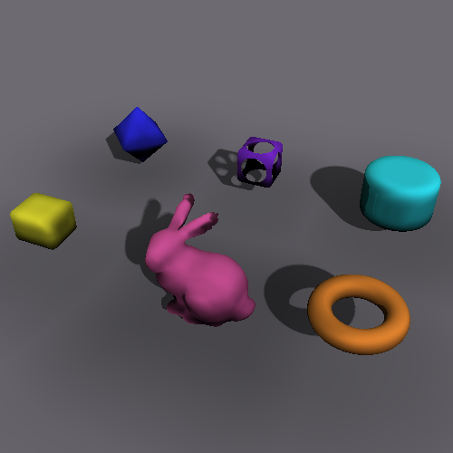

I would also recommend you to use *Typora*, a markdown file reader to view README.md in this folder, for better reading experience.


## 0. Logs

#### Features

* Common mesh loading with *ASSIMP*
* Ray Marching with SDF
* SDF calculation of various constructive geometries
* SDF generation for arbitrary mesh (e.g. bunny.ply)
* Store and Load SDF texture data
* Scene combined with mesh and constructive geometries
* Shading, with soft shadows, ambient occlusion

#### To-Do's

* Camera: ~~keyboard~~ and mouse control
* ~~SDF: per-mesh SDF generation in preprocessing~~
* ~~SDF: texture caching and storing (compressing?)~~
* Landscape: represent global height field, and combine with SDF
* ~~Shader: shading function, coloring, ambient occlusion~~
* ~~File System: mesh name, I/O method, SDF importing (avoid to generate the same SDF each run, time consuming!)~~
* Mesh & SDF: mesh instancing, apply mesh transformations to SDF query
* SDF generation multi-tasking
* GPU: transport the project to GPU


## I. Environment / Requirements

* Platform: Ubuntu 16.04 LTS
* Processer: Intel Core i7-8700
* Compiler: gcc(g++) 5.4.0 (should be fine with any recent versions)
* Programming language: C++

#### Tools and Third-party libraries

cmake:

``sudo apt install cmake``

SDL:

``sudo apt install libsdl-dev``

ASSIMP:

``sudo apt install libassimp-dev libassimp-tuils``


## II. How-to's

#### How to run?

``cd //path/to/Project/``

Generate the project and run :

1. ``cmake CMakeList.txt``
2. ``make``
3. ``./Run``

In case you cannot generate the project with CMake, check if there exist **CMakeCache.txt** cache file in the folder, please remove it first:

``sudo rm CMakeCache.txt``


#### How to make full use?

If you have the interest to read the codes or make modifications, please feel free and go ahead. And here are some tips before you start.


For convenience, I define a file called **debug.h** in the **Project/src/** folder, enclose you can find 4 macros

```c
#define DEBUG
#define TIMING
#define SCREENSHOT
#define PREZ
```

these are switches that control the functions of the program. 

* DEBUG: output some useful information of current run in the console. 
* TIMING: output frame render time in the console.
* SCREENSHOT: save the last frame before close into **Project/shots/** as a .bmp file
* PREZ: render additional geometries in the scene when TRUE, otherwise only render the bunny.


Another file called "parameters.h" in the same folder, include all the parameters that use to control the scene, distance field, camera and light. Things are commented, and you could have a try to change some of them then check the outcome.

Don't forget to recompile every time you modify any file, simply enter ``make`` in the console.


---

## 1. Introduction

**Signed Distance Field** (SDF) is a variation of distance field, which in a 3D(2D) space maps a *position* to its distance to the *nearest* plane (edge). Distance field has been applied in many studies, such as image processing, physics, and computer graphics. In the context of computer graphics, distance fields are usually signed, aka. signed distance field, to indicate whether certain position is inside a mesh or not.

In computer graphics and game development, SDF shows great versatility, it can be used for collision test, mesh representation, ray tracing, etc. Besides, people find that it comes along with some bonus when the scene is rendered with ray-tracing (namely, ray-marching) algorithms -- shadow effects like **soft shadows** and **ambient occlusion** can be produced with almost no extra cost.

This project is about a start-from-scratch C++ implementation of a **real-time ray marching renderer**, which includes a baking tool of SDF texture and produces soft shadow effects. During the implementation we make use of some existing tools: ASSIMP for mesh importing and  for screen presentation. All references will be listed at the end of this document.


## 2. Cornerstones

#### 2.1 Camera and screen set-up

The camera working for ray tracing is different from ones working for conventional pipeline; Instead of converting everything to the camera's view space, ray tracing camera shots rays into the scene, so that the rays should be transformed from screen space to world space.

As the final deliverable was expected to be a navigator where you can check the objects from any direction, we preserve the idea to rotate the camera  around the origin, and define the ``Camera`` class in a LookAt() style. Besides, it contains necessary members such as screen configurations and view frustum to generate rays correctly. The definition of the class is shown in the snippet below.

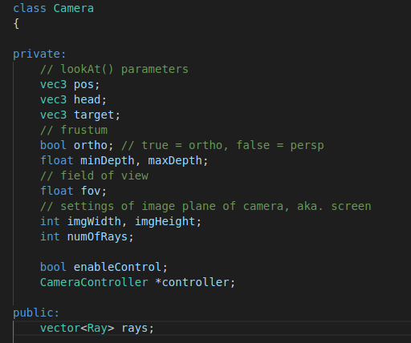

``CameraController`` is the class to move the camera around, it is implemented with keyboard listeners; while it could be more complete by adding mouse listeners, which is not yet implemented.

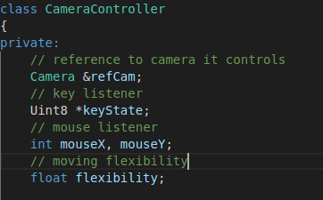

To set pixels according to a frame rendered we furthermore introduce the ``Screen`` class, which is a common pack-up of the SDL functions, since they're provided in the labs, we won't talk much about it.


#### 2.2 Scene, model and mesh loading

We use ASSIMP to help load various format of mesh files, and define a ``Mesh`` class to as the basic integrated unit of scene representation. The scratch of this class refer to the mesh class provided by https://learnopengl.com/, while in practice the codes are highly adapt to the use of this project.

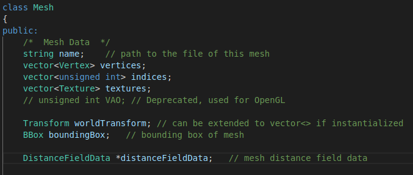

The buffer handle used for OpenGL is removed, we keep the mesh and include bounding box, transform and distance field data of the mesh. Additionally, we give name to meshes, in order to enable saving/loading distance field data afterwards.

``Mesh`` is contained within a ``Model``, and models are contained by ``Scene``, we keep this level structure to make sure the codes are prepared for extension, since at present we only use a bunny mesh in this project.


## 3. Core Functions

#### 3.1 SDF generation

When a mesh is constructing, the program would automatically create the distance field data for it. If you have read about distance field, you may know something called [analytical distance functions](http://www.iquilezles.org/www/articles/distfunctions/distfunctions.htm), which calculate the exact distance from any position to certain geometry shapes, like a box or a cylinder. However, the distance field of arbitrary mesh is not as simple as those geometries, and approaches which decompose meshes into constructive geometries seem not practical. In this project, the solution is sampling, which is to do brute-force ray tracing at a number of sample points and record the minimum distance.

In other words the local space of the mesh is *voxelized*, to calculate how many voxels we use to represent the distance field, we set a default ``DF_MIN_NUM_VOXEL_PER_DIM=8`` which means there are at least 8 voxels on the shortest axis of the local bounding box, then we keep a variable ``resolution`` to control the actual amount of voxels, the higher this value, the more voxels created.

The bunny mesh has some holes hence is not completely closed, so we applied a method to distinguish inside sample points, the basic idea is to keep a counter indicates the number of rays hit on back faces, if the counter exceeds a certain number (proportion), the sample point should be inside of the mesh.

For readability here put the pseudo-code written in Python, as follows,

```python
# DF bbox should be slightly larger
BBox = CalculateDistanceFieldBBox(mesh.bbox)
# Calculate Volume grid dimensions according to bbox and resolution
VolumeDimension = CalculateVoxelDimension(BBox, resolution)
# Generate sample ray direction
SampleDirections = GenerateSampleRayDirections(1200)

# for each sample location, do brute-force ray tracing
for (X,Y,Z) in VolumeDimension.XYZ:
    minDistance = VolumeMaxDistance
	for sampleDir in SampleDirections:
        # calculate ray(pos, dir)
        ray = (LocalSpace(X,Y,Z), sampleDir)
        # ray-mesh intersection
        (boolHit, curDistance, hitNormal) = Intersect(mesh, ray)
        if(boolHit):
            hit++
            # bac kface counter
            if( dot(sampleDir, hitNormal)):
                hitBack++
			minDistance = min(minDistance, curDistance)
            
	# ! the position is inside if >50% rays hit back face
    if (hitBack > SampleDirections.num * 0.5f):
        minDistance *= -1
	# ! for meshes that is not entirely close, 
    # ! this is the smooth operation on the border of in-outside. 
	if (minDistance < voxelSize && hitBack > 0.95 * hit):
        minDistance = - abs(minDistance)
        
    OutData[X,Y,Z] = minDistance
```

##### complexity problem

The generation of distance field works fine when we set ``resolution = 1.0f``, that is to use 8 voxels on the shortest axis, it applies to the bunny, creating a 10x10x8 grid, and within each grid cell there runs 1200 brute-force ray tracing; as we use the zipped bunny mesh which has 4k triangles, the calculation of distance field takes about half a minute.

Things get tough when higher resolution of distance field is required, since we are using CPU processors the task is completely in a sequential style, it takes hours to calculate a distance field of 41x40x32 grid cells. To alleviate such problem we promote three possible solution, the (1) first one is to transport the calculation to GPU, which would largely reduce the running time; the (2) second is to enable multi-tasking on CPU, a way that is used by the Unreal Engine 4 for distance field generation; the (3) third is to try another method to calculate the shortest distance, i.e. the point-and-triangle-feature algorithm proposed in "Real-time Collision Detection" by Christer Ericson, we didn't choose this method because it has limitations when the mesh is not closed, besides it's less intuitive than ray tracing. The project is still growing and it may introduce the first or second solution later.


#### 3.2 Ray-marching algorithm and SDF

Ray marching algorithm is a variation of ray tracing, and the thing we describe here is also known as "**Sphere tracing**". Sphere tracing algorithm should come with an exact or approximate SDF function ``SDF(position)`` which describes the nearest distance value at any place in the space. In ray marching, the transportation of ray is decomposed into discrete steps, this is possible because the property of SDF guarantees that within this distance you won't hit or miss anything, so that the ray can step as the [figure](https://www.google.com/search?q=ray+marching&rlz=1C1GCEU_zh-CNCN855CN855&tbm=isch&source=iu&ictx=1&fir=ozxYkxrmCIjowM%253A%252CyLAtmMCY6hXOpM%252C%252Fm%252F0b2r6k&vet=1&usg=AI4_-kTzB3M_mZCSZwcyzO-pQdNtWB6KbQ&sa=X&ved=2ahUKEwj_hLud95XjAhVRFqYKHaGmBFYQ_h0wE3oECAgQBQ#imgrc=ozxYkxrmCIjowM:&vet=1) (source: Google) below:


Based on the idea, the pseudo code of sphere tracing algorithm is rather straightforward:

```python
for ray in RaysCameraToPixel:
    travel = 0
    step = 0
    currentPos = ray.pos
    dist = SDF(currentPos)
    while(dist > _hit_threshold_ && step < _max_step_):	# not hit & not overstep
        travel += dist	# march a step
        step += 1	# increase step counter
        currentPos = ray.pos + ray.dir * travel	# next position
        dist = SDF(currentPos)	# sdf query
    # hit
    shading()
```

noted that we should set an upper bound for marching step, otherwise when a ray is almost parallel to a surface, the distance may converge very slow thus time consuming. 

##### [Implicit distance functions](http://www.iquilezles.org/www/articles/distfunctions/distfunctions.htm)

Implicit distance function is an analytical function that represents the distance to a much regular object in the space, introduced by Íñigo Quílez. The functions help represent a huge class of constructive geometries,  and are at many places used demos of distance functions. In our project we combine the bunny mesh and some basic geometries, rendering them together in a scene, as you may check in Chapter 4.


#### 3.3 Distance Field Representation

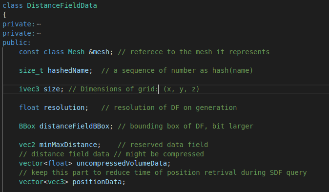

The ``class DistanceFieldData`` consists of necessary data that represent the distance field of a mesh. The basic idea during this class design is considering how can we retrieve distance data in an efficient way, hence we restore the bounding box of the distance field and its size of grid. Besides the most important distance values, we also keeps the positions of the center of each grid as landmarks, avoiding the recalculation at render time.

You might discover that distance fields keep another bounding box apart from the original mesh, and we note that the bounding box of distance field should be bit **larger**, this is due to the fact that you cannot generate a global distance field of a scene (because of limited RAM) therefore must keep the distance field of meshes locally; when a ray travels in the scene, there should be a transfer step before which the marching uses global SDF while after which uses local SDF, plus that this transfer shouldn't be exactly on the border of the distance field, so use the *mesh* bounding box as the border.


#### 3.4 Soft shadows and Ambient Occlusion

##### Soft shadows

Soft shadows we use in this project is also known as the **penumbra**, these are certain areas of surface which is lighted but also somewhat occluded; Usually, this effect happens when the light source is larger than the object receiving light, while in the project we use a global directional light but inherit the basic idea. The Huygens–Fresnel principle indicates that a wavefront of light can be treated equally as a series of light sources, each of which continue to beam light to latter phases, so when the light path reaches near an opaque object, the light is partially occluded, that's how we calculate soft shadows here.

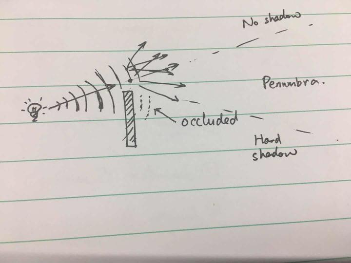

The source code of soft shadow calculation is given below, the parameters are named as their meanings.

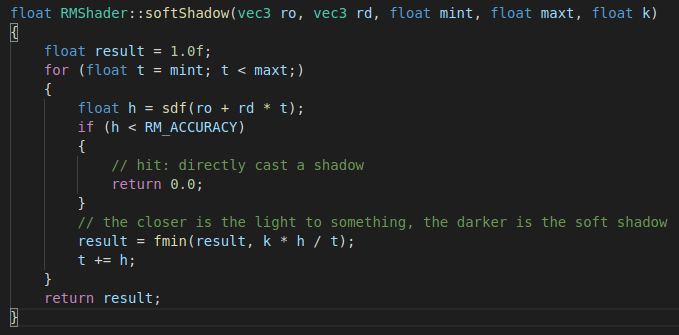


##### Ambient Occlusion

Ambient Occlusion is another shadowing effect that add soft shadows to a scene to make it looks good. The general idea is that opaque objects can influence ambient lights casting on other objects, however, to check if objects are close to one another is not that easy, so people have introduced cheaper approximation like Screen Space Ambient Occlusion (SSAO), Screen Space Directional Occlusion (SSDO), etc. They sometimes look fine while in other times create artefacts. 

Distance Field Ambient Occlusion (DFAO) comes with distance field with almost no extra cost, with merely several more steps of SDF texturing it could create plausible realistic effects; the idea is also very intuitive: closer sample (step) points contributes more to the ambient occlusion to a surface, and closer objects create denser occlusion. Codes are shown below.

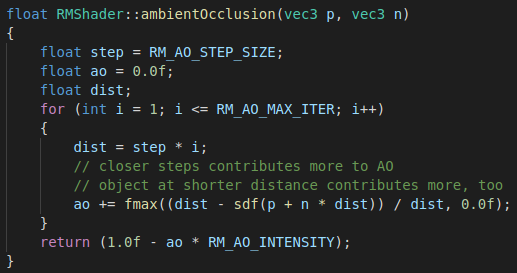


## 4. Outcomes

#### 4.1 Screenshots

The completion of this project takes some time, I make a recording screen-shot at each milestone. You may find the screen shots in the local folder **./shots**

1. After I complete the basic camera settings, the screen and the ray marching renderer, I create a plane and a sphere to test if the camera and the ray marching algorithm works fine.

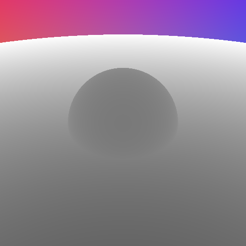

2. After finishing the mesh importing and the distance field generation function, I use the generated distance function into the renderer, and it seems that the voxels are correctly detected.

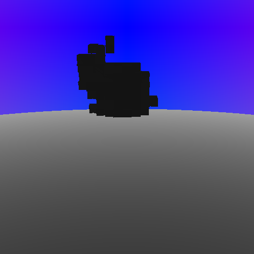

3. Instead of returning the value at the center of the voxel, now the distance function applies tri-linear interpolation, and the soft shadow part is added. Noted that the resolution of SDF is low at present, so the ears of bunny are flawed.

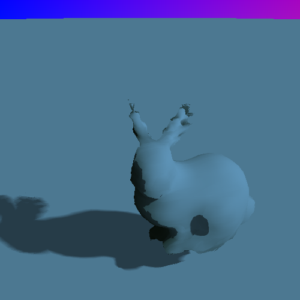

4. It takes some time to generate a more accurate distance field, now the bunny looks better; also at this time, to avoid regenerating the distance field every run, I give names to meshes, and add functions to import and export distance fields with files.

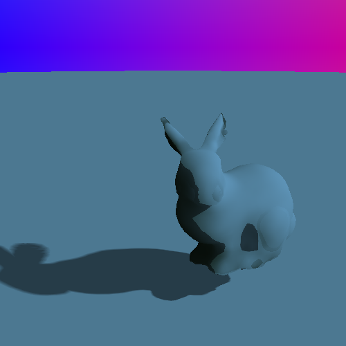

5. Then I referred to the distance functions of geometries, put them together with the bunny.

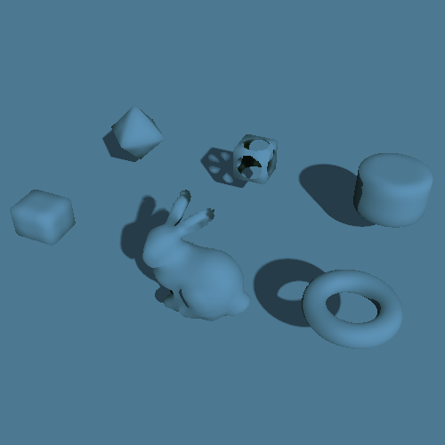

6. Now it's time to give them colors, same time I add the ambient occlusion part into shading function.


To help you identify the AO effect much clearer, I make a comparison here:

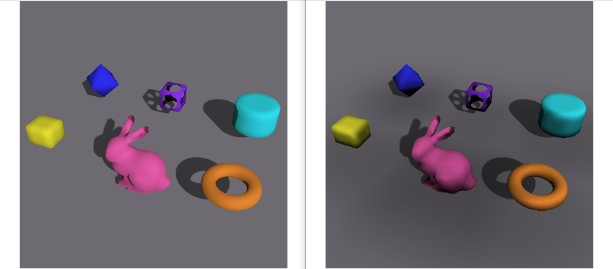


#### 4.2 Running time

When the screen size is set 500x500 pixels, the render fps is about 2 frames/second, it runs slow due to large cost on SDF query, but if you modify the screen settings in **src/parameters.h**, like using a 200x200 screen, the rendering would reach real-time level.


## 5. Discussion

I have to admit that this project can be further improved, I've met some problems but also find some solutions, with motivation I would spend time to complete my ToDo's and find out more to be done.

The current implementation is slow on SDF generation, which is the very first task I would work with. It also have some problem with visual effects (sometimes), that the bounding box of the bunny may influence the ambient occlusion calculation, as you may see in the following picture, there's a light square beneath the bunny, this happens when you adjust the step size of ambient occlusion, and I believe the core of this problem is the discontinuity of the global distance field, at the border of the bunny's mesh box. I'll look into this and alleviate the artefect.

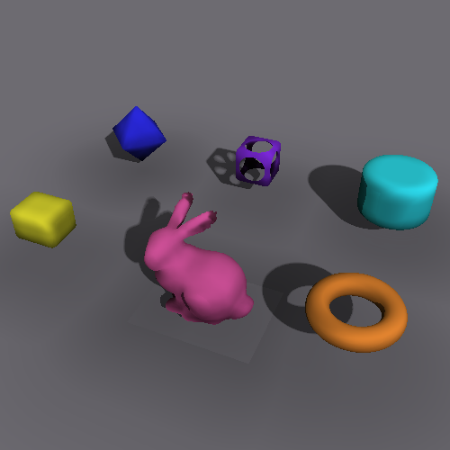


## 6. Declaration

I hereby declare that the documents and codes of this project are completed by my self, work that doesn't belong to me are all noted in reference.


## 7. Reference

1. Sramek, M. . (2006). 3d distance fields: a survey of techniques and applications. IEEE Transactions on Visualization & Computer Graphics, 12(4), 581-599.
2. [Íñigo Quílez: Distance functions](http://www.iquilezles.org/www/articles/distfunctions/distfunctions.htm)
3. [Unreal Engine 4: Distance Field Ambient Occlusion](https://docs.unrealengine.com/en-US/Engine/Rendering/LightingAndShadows/DistanceFieldAmbientOcclusion/index.html)
4. [Youtube: A ray marching shader tutorial](https://www.youtube.com/watch?v=oAS74MscuLY&list=PL3POsQzaCw53iK_EhOYR39h1J9Lvg-m-g&index=1)
5. [LearnOpenGL.com: Assimp and basic mesh loading](https://learnopengl.com/Model-Loading/Assimp)